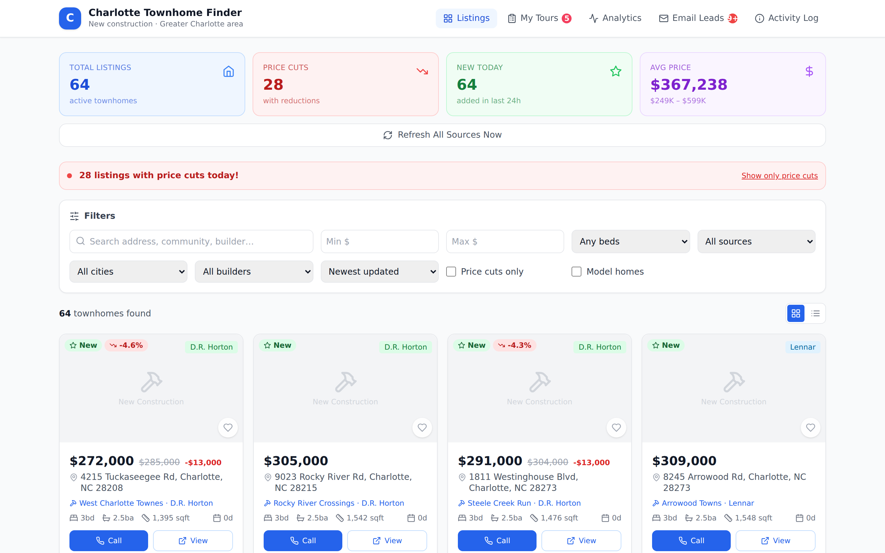
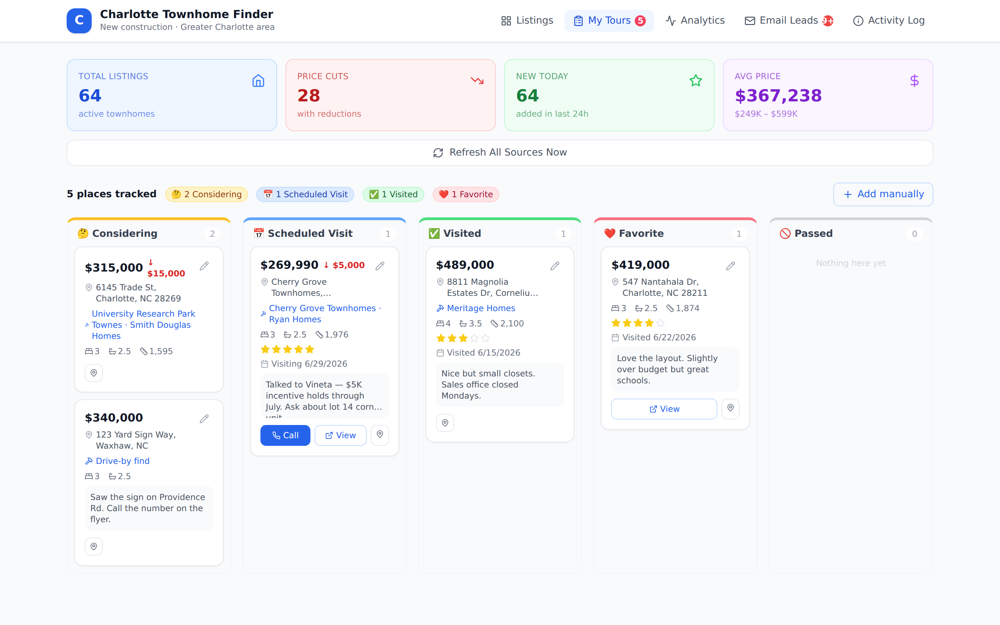
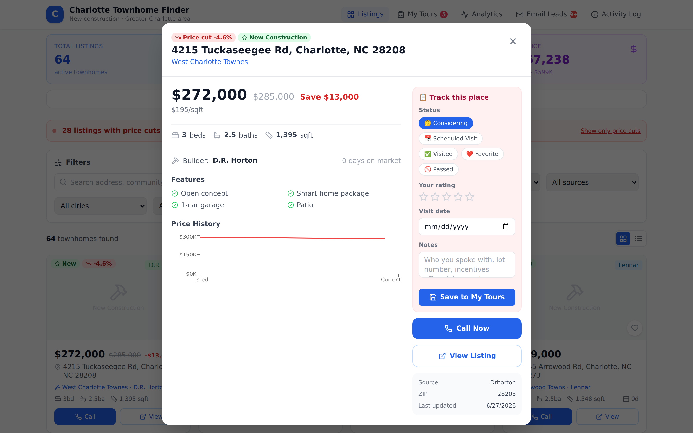

# Charlotte Townhome Finder

A full-stack aggregator dashboard for new construction townhomes in the greater Charlotte, NC area, with an optional private Gmail ingestion mode.

## Screenshots

**Listings — every source in one grid, with live price-cut alerts**


**My Tours — a personal board for places you visit or are considering**


**Listing detail — price history + one-tap tracking & contact**


## What it does

- **Aggregates** listings from Zillow, Realtor.com, Opendoor, Homes.com, NewHomeSource, and direct builder websites (D.R. Horton, Lennar, Ryan Homes, Meritage, Eastwood, Smith Douglas, and more)
- **Tracks price cuts** — shows original vs. current price, % reduction, and dollar savings
- **Optionally scans Gmail locally** for real estate alerts, builder emails, and price-drop notifications; inbox-derived data is excluded from Git and public builds
- **Runs on a schedule** — automatic refresh at 7 AM and 12 PM Eastern every day
- **Dashboard** — filter by price, beds, city, builder, source, furnished, leaseback; sort by price cut %, freshness, size; click any listing to see details + price history chart + call button
- **Invest tab (HouseCanary-style)** — every listing gets a 0–100 investment score (value vs submarket $/sqft, rent yield, growth forecast, price-cut momentum, model/furnished/leaseback fit), rent + cap-rate + cash-flow estimates, a 17-submarket intel table, and a builder model-sale/leaseback program directory tuned for finding furnished models under $350K with sale-leaseback terms (including the SC 6% investor-tax warning)

## Quick start

```bash
# Install dependencies
npm run setup

# Start both server (port 3001) + client (port 5173) together
ALLOW_PRIVATE_LOCAL=true npm run dev
```

Then open **http://localhost:5173**

The backend binds to `127.0.0.1` by default. `ALLOW_PRIVATE_LOCAL=true` enables
the private refresh, logs, email-lead, research, and tracked-place endpoints for
loopback requests only. Do not expose that mode to a network; production private
features require real server-side authentication.

## Hosting on GitHub Pages (static, read-only)

GitHub Pages can't run the Node/SQLite backend, so there's a **public static build**
that generates an allowlisted snapshot in `client/public/data.json` and stores your tour
tracker in the browser's `localStorage`. A GitHub Actions workflow
(`.github/workflows/deploy-pages.yml`) builds and publishes it automatically.

The public snapshot excludes Gmail listings, email leads, tracked places,
private research, private model-home leads, and deal-room material. The generated
`data.json` is ignored by Git so a local snapshot is not committed accidentally.

**One-time setup** (you only do this once, in the GitHub UI):

1. Go to **Settings → Pages**
2. Under **Build and deployment → Source**, choose **GitHub Actions**
3. Push to the branch (or run the workflow manually from the **Actions** tab)

The site publishes to:
`https://bitflipper1.github.io/find-my-home/`

Build it locally to preview the exact static artifact:

```bash
npm run build:static
npx serve client/dist   # or any static server
```

**What works in the static version:** browsing/filtering/sorting public listings,
price-cut highlights, the listing detail modal with price history, analytics,
the public builder knowledge base, and the full **My Tours** tracker (saved per-browser).
**What doesn't:** private Research, Deal Room, Email Leads, live "Refresh", or Gmail updates —
those need the backend. The data refreshes whenever the site is rebuilt (every
push, or on demand from the Actions tab).

For the always-fresh experience, run the full stack (`npm run dev`) or host the
server somewhere that can run Node (Render, Railway, Fly.io, a VPS).

## Gmail — private local mode

The application can ingest a Gmail connector export or use direct OAuth. Private
connector output is written to:

- `server/data/gmail-listings.json` — full listings (price, beds/baths/sqft, builder, phone) → shown in the dashboard as the **📧 Your Inbox** source
- `server/data/gmail-leads.json` — price-cut / open-house / builder alerts → shown in the **Email Leads** tab

Both files are gitignored. The server can ingest them locally, but the public
snapshot exporter rejects their listing source and never publishes email leads.
See
[`AUTOMATION.md`](AUTOMATION.md) for how the daily scan is scheduled.

### Optional: direct OAuth mode
If you'd rather have the server hit the Gmail API itself (instead of the
connector-driven file refresh), copy `server/.env.example` → `server/.env` and
fill in `GMAIL_CLIENT_ID` / `GMAIL_CLIENT_SECRET` / `GMAIL_REFRESH_TOKEN`. The
server auto-detects credentials and uses them when present.

## Privacy boundary

- Keep contracts, payment records, negotiation notes, inbox exports, and personal research out of this public repository.
- Client-side passphrases are not authentication; the Deal Room remains disabled until server-side authentication exists.
- The public exporter is allowlist-based and covered by tests. Run `npm test` before publishing.
- Removing a file from the current branch does not remove it from Git history. If sensitive material was previously committed, treat history cleanup and repository visibility as a separate incident-response step.

## Data sources

| Source | Type | Notes |
|--------|------|-------|
| Zillow | Aggregator | New construction + price changes |
| Realtor.com | Aggregator | MLS data with builder info |
| Opendoor | iBuyer | Resale + quick-close townhomes |
| Homes.com | Aggregator | CoStar-powered listings |
| NewHomeSource | New construction only | Best for builder communities |
| D.R. Horton | Builder direct | Largest US builder |
| Lennar | Builder direct | Wi-Fi certified homes |
| Ryan Homes / NVR | Builder direct | Popular in Charlotte suburbs |
| Meritage Homes | Builder direct | Energy-efficient focused |
| Eastwood Homes | Builder direct | Charlotte-based, strong local presence |
| Smith Douglas Homes | Builder direct | Affordable new construction |

## Top Charlotte builder communities covered

Charlotte proper · Matthews · Huntersville · Cornelius · Mooresville · Mint Hill · Concord · Indian Land SC · Waxhaw · Pineville · Gastonia · Fort Mill SC

## Architecture

```
/
├── server/          Node.js + Express + SQLite
│   ├── src/
│   │   ├── db.js            SQLite (listings, price history, email leads, logs)
│   │   ├── aggregate.js     Runs all scrapers, saves to DB
│   │   ├── scheduler.js     node-cron — 7 AM + noon daily
│   │   ├── gmail.js         OAuth2 Gmail inbox scanner
│   │   └── scrapers/
│   │       ├── zillow.js
│   │       ├── realtor.js
│   │       ├── opendoor.js
│   │       ├── newhomesource.js
│   │       ├── homes.js
│   │       └── builders/index.js
│   └── index.js     REST API (port 3001)
└── client/          React 18 + Vite + Tailwind CSS
    └── src/
        ├── App.jsx
        ├── api.js
        └── components/
            ├── StatsBar.jsx
            ├── FilterPanel.jsx
            ├── ListingCard.jsx
            ├── ListingModal.jsx    price history chart + contact info
            ├── SourceBreakdown.jsx bar charts
            ├── EmailLeads.jsx
            └── ActivityLog.jsx
```

## API endpoints

| Endpoint | Description |
|----------|-------------|
| `GET /api/listings` | All listings (filterable: source, city, builder, minPrice, maxPrice, beds, priceCut, sort) |
| `GET /api/listings/:id` | Single listing with full price history |
| `GET /api/stats` | Dashboard stats (total, price cuts, avg price, by source, by builder) |
| `POST /api/refresh` | Trigger a manual scrape now |
| `GET /api/builders` | Builder summary with price ranges |
| `GET /api/cities` | City breakdown |
| `GET /api/email-leads` | Emails found in Gmail |
| `GET /api/logs` | Scrape activity log |

## Notes on scraping

Most aggregator sites (Zillow, Realtor.com, etc.) block automated requests — the server gracefully falls back to curated sample data so the dashboard always has content. As those sites update their bot-protection policies, the scrapers automatically get the real data when available. Builder sites (D.R. Horton, Lennar, etc.) tend to be more accessible.

For production use, consider adding a RapidAPI key for enhanced Zillow/Realtor.com access.
